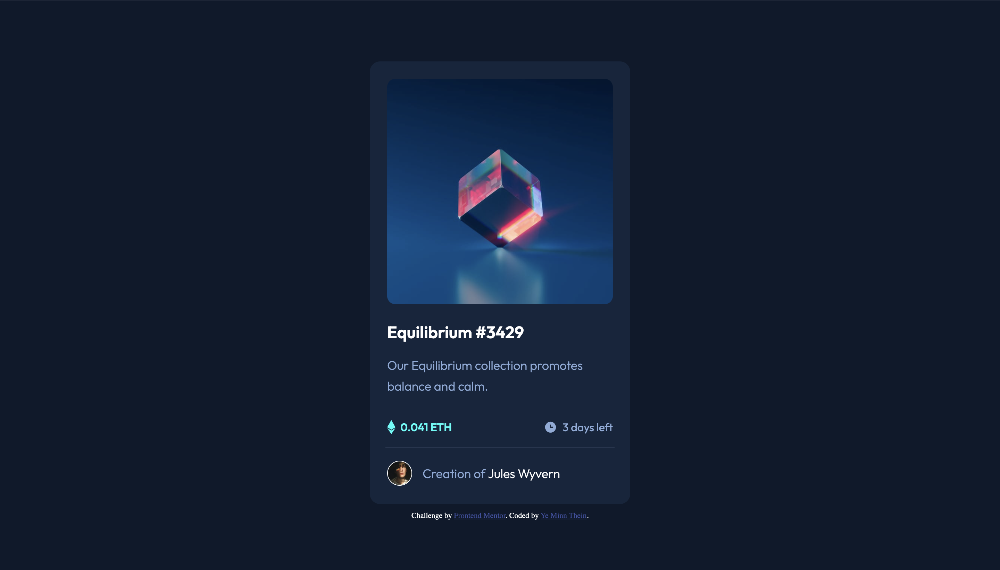

# Frontend Mentor - NFT preview card component solution

This is a solution to the [NFT preview card component challenge on Frontend Mentor](https://www.frontendmentor.io/challenges/nft-preview-card-component-SbdUL_w0U). Frontend Mentor challenges help you improve your coding skills by building realistic projects. 

## Table of contents

- [Overview](#overview)
  - [The challenge](#the-challenge)
  - [Screenshot](#screenshot)
  - [Links](#links)
- [My process](#my-process)
  - [Built with](#built-with)
  - [Continued development](#continued-development)
  - [Useful resources](#useful-resources)
- [Author](#author)
- [Acknowledgments](#acknowledgments)

## Overview

### The challenge

Users should be able to:

- View the optimal layout depending on their device's screen size
- See hover states for interactive elements

### Screenshot

### Links

- Solution URL: [GitHub repo](https://github.com/ymt-github/project_nft_pvc.git)
- Live Site URL: [GitHub page](https://ymt-github.github.io/project_nft_pvc/)

## My process
- Write HTML 
- Add styles with CSS using flexbox and basic CSS properties
- Testing on chrome with different screen sizes
- Write README.md
- Upload to GitHub
- Done

### Built with

- Semantic HTML5 markup
- CSS custom properties
- Flexbox
- Mobile-first workflow

### Continued development

- I will add animation for image overlay

### Useful resources

- [CSS Cheatsheet](https://overapi.com/css) - This helped me for forgotten syntax.

## Author

- GitHub - [Ye Minn Thein](https://github.com/ymt-github?tab=repositories)
- Frontend Mentor - (https://www.frontendmentor.io/profile/ymt-github)
- Twitter - [@ymt_tweet](https://twitter.com/ymt_tweet)

## Acknowledgments
Thank you Frontend Mentor Team for making open-challenge for free.